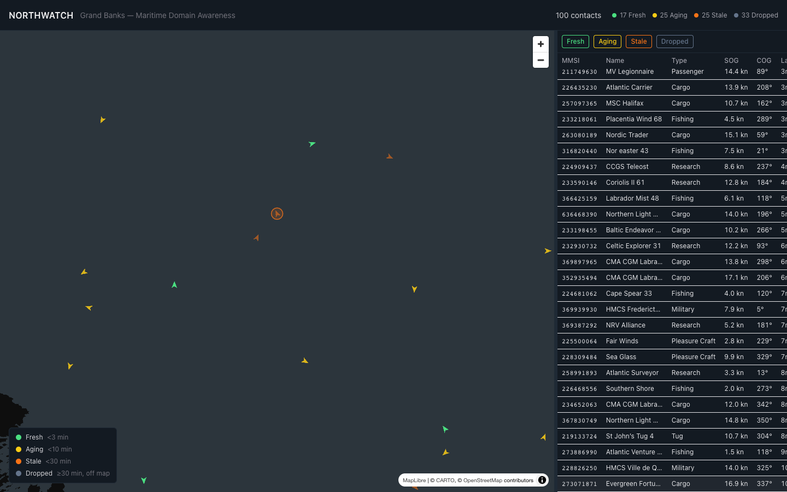

# NorthWatch

**Live demo:** [jamy11.github.io/northwatch](https://jamy11.github.io/northwatch/)



A synthetic maritime domain awareness (MDA) dashboard for the Grand Banks off Newfoundland, showing vessel traffic, contact staleness, and dead-reckoning uncertainty rendered live on a dark-themed map.

No backend. A client-side simulation clock drives ~100 synthetic AIS contacts, advancing their positions by dead reckoning and periodically refreshing their last-seen time. A portion of vessels go silent so you can watch contacts age in real time.

## Stack

- Vite + React 18 + TypeScript (strict)
- MapLibre GL JS
- Chakra UI v3 (`createSystem` / `defineConfig`)
- Zustand

## Features

- **~100 synthetic vessels**: realistic MMSIs (real Maritime Identification Digits), ship-type-weighted names, positions scattered across the Grand Banks (42-52N, 46-60W) and kept off land by a coastline mask.
- **Live vessel map**: CARTO dark-matter basemap, vessels rendered as a GeoJSON symbol layer rotated by heading. Position updates are pushed straight to the MapLibre source via `setData()`, so the map never re-renders through React.
- **Derived contact staleness**: fresh (<3min) / aging (<10min) / stale (<30min) / dropped (>=30min), computed live from each vessel's `lastSeen` and never stored. Styled on the map via MapLibre `match` expressions on color and opacity, with a legend.
- **Growing uncertainty circle**: selecting a vessel draws a geodesically-accurate circle (`sog_knots × elapsed_hours × 1852m`) around its last known position, visibly expanding as the contact ages.
- **Contact table**: MMSI, name, ship type, SOG, COG, last seen, and a staleness badge. Sortable by column, filterable by staleness bucket, and synced to the map selection in both directions: clicking a row flies the map to that vessel, clicking a vessel scrolls the table to it.
- **Resizable split view**: drag the divider between the map and the table to resize either pane.

## Running locally

```bash
npm install
npm run dev
```

Other scripts: `npm run build` (typecheck + production build), `npm run lint` (oxlint), `npm run preview` (serve the production build).

## Notable implementation details

- **Staleness is a derived value, not state.** Nothing stores "this vessel is stale"; it's recomputed from `lastSeen` every time it's needed, driven by a single `useNow()` hook on the React side and a matching interval on the map side.
- **Vessels report on their own staggered schedule**, not in lockstep with the position-simulation tick. Early on this caused every contact to snap back to "fresh" within seconds of loading, wiping out the deliberately-varied initial staleness spread; each vessel now has its own `nextReportDue` so contacts age and refresh independently.
- **The uncertainty circle is a real geodesic polygon** (great-circle destination-point formula), not MapLibre's pixel-based `circle-radius`, so its radius reads correctly in meters at any zoom level or latitude.
- **The coastline mask is a coarse set of hand-tuned bounding boxes** covering Newfoundland, Labrador, and the Quebec Lower North Shore. Good enough to keep vessels off land for a demo, not a real hydrographic dataset.

## Status

All planned features are implemented. Built and reviewed incrementally, checking in after each step.
